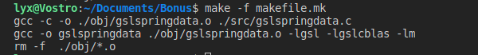
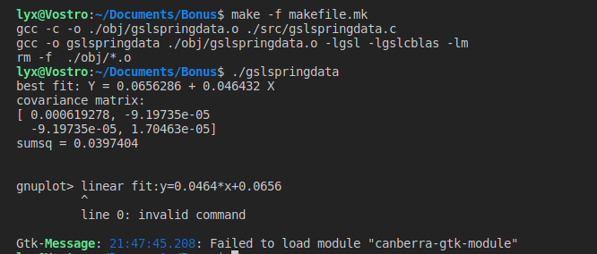
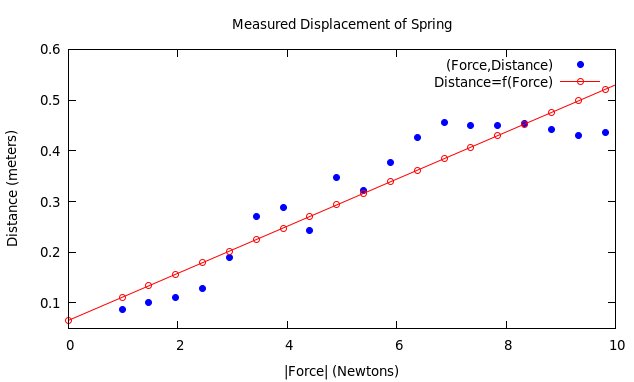
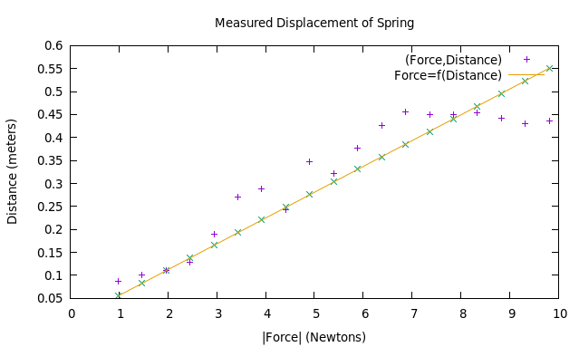
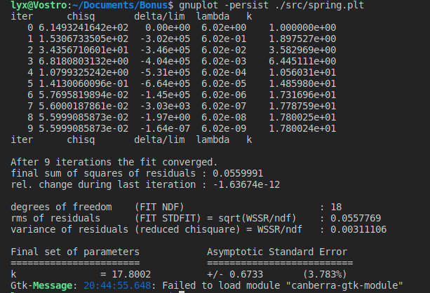
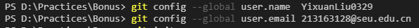
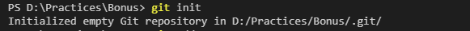
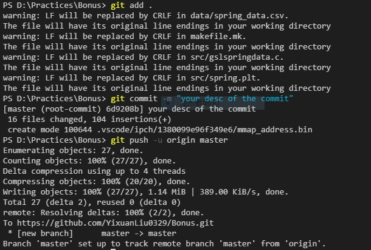
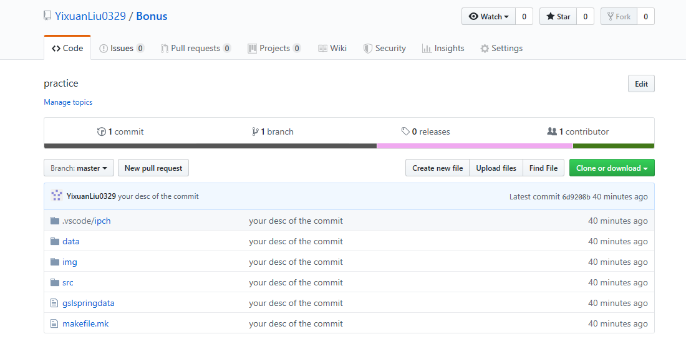

# 工作说明

## 1. GSL(under Ubuntu)

**Step1 源代码`.c`**
* 从文件`spring_data.csv`中读取数据；
* 将数据存放到数组`x[],y[]`中；
* 利用`gsl`进行拟合，并输出结果；
* 利用`gnuplot`对数据进行可视化。

**Step2 makefile**<br>
通过makefile生成可执行文件。
```makefile
CC=gcc

SRCDIR=./src/
OBJDIR=./obj/

all: maingsl

clean:
	rm -f ./gslspringdata

maingsl: fileobj
	$(CC) -o gslspringdata $(OBJDIR)gslspringdata.o -lgsl -lgslcblas -lm
	rm -f  ./obj/*.o

fileobj:  
	$(CC) -c -o $(OBJDIR)gslspringdata.o $(SRCDIR)gslspringdata.c
```

**Step3 生成可执行文件并执行**<br>
输入命令`make -f makefile.mk`，生成可执行文件，运行后有以下结果<br>


**Step4 运行可执行文件**<br>
输入命令`./gslspringdata`，有以下结果：<br>
<br>
同时获得可视化数据：<br>



## 2. Gbuplot(under Ubuntu)
编辑`spring.plt`程序，输入命令`gnuplot -persist ./spring.plt`，即可对数据进行可视化。<br>




## 3. Version control with Git,Github(under Windows)

**Step1 配置账户**<br>


**Step2 初始化**  <br>
初始化前，现在github中建立与本地文件夹名字相同的仓库。新建时不要包含`README.md`。<br>


**Step3 更新仓库**<br>
第一次更新，需要登陆Github账户:<br>
<br>
第一次对仓库进行更新：<br>
<br>
更新后的仓库：<br>


**Step4 再次更新**<br>
编辑好`README.md`文件，再次对仓库进行更新。<br>
